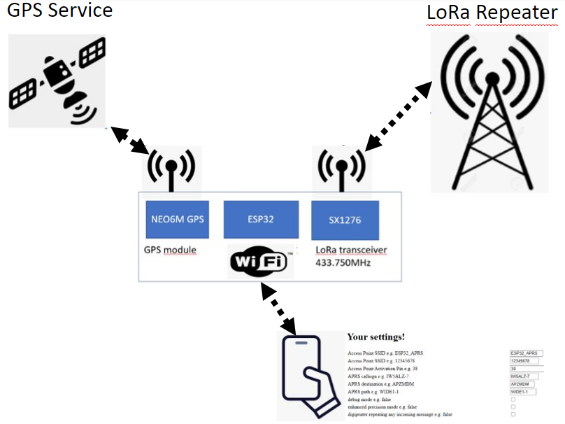
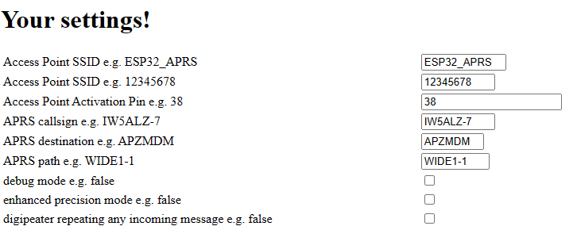
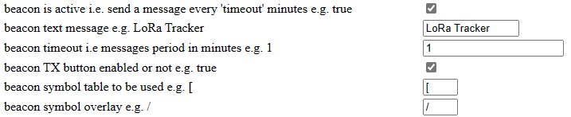
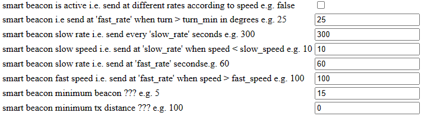
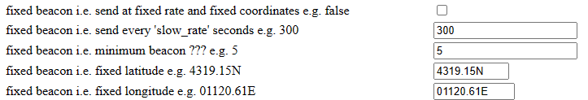
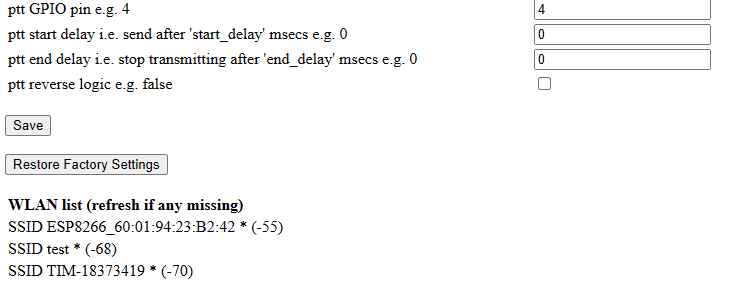

# Fork 

This LoRa APRS Tracker is derived from (https://github.com/lora-aprs/LoRa_APRS_Tracker) by [peterus](https://github.com/lora-aprs/LoRa_APRS_Tracker/commits?author=peterus)

I added an Access Point and Captive Portal for easy configuration. 

# LoRa APRS Tracker with Access Point for real time configuration 

# Supported boards

You can use one of the Lora32 boards:

* TTGO T-Beam V0.7 (433MHz SX1278)
* TTGO T-Beam V1 (433MHz SX1278)

This boards cost around 35 Euros and includes a small 0.96" display
Keep in mind: you need a 433MHz version!

# Compiling and configuration

# How to compile

The best success is to use PlatformIO (and it is the only platform where I can support you). 

* Go to [PlatformIO](https://platformio.org/) download and install the IDE. 
* If installed open the IDE, go to the left side and click on 'extensions' then search for 'PatformIO' and install.
* When installed click 'the ant head' on the left and choose import the project on the right.
* Just open the folder and you can compile the Firmware.

# Configuration

* Press the service button (the middle one) for more than 5 seconds and a WiFi hotspot will be alive (SSID: ESP32_APRS)
* Connect to it with your smartphone or PC using the password 12345678
* After connection navigate to http://192.168.4.1 and the settings web page will show

# Access Point settings

## Beacon modes
activate ony one!!!

# plain beacon
* These are the settings for a beacon transmitting the GPS coordinates every 20 minutes

# smart beacon
* These are the settings for a beacon transmitting the GPS coordinates more frequently if the tracker moves at a higher speed 

# fixed beacon
* These are the settings for a beacon transmitting fixed coordinates (not using GPS) 

* These are the settings for an external transmitter connected by its Push To Talk 
* Pleas note that you can save the settings or restore default settings

## LoRa iGate

# fixed beacon
Look at my other project: a [LoRa iGate](https://github.com/peterus/LoRa_APRS_iGate)
